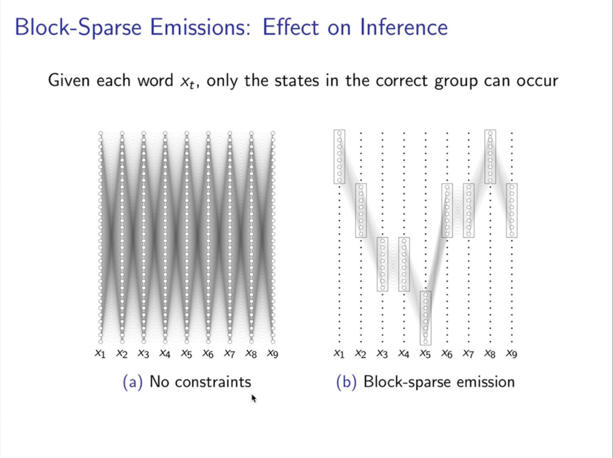
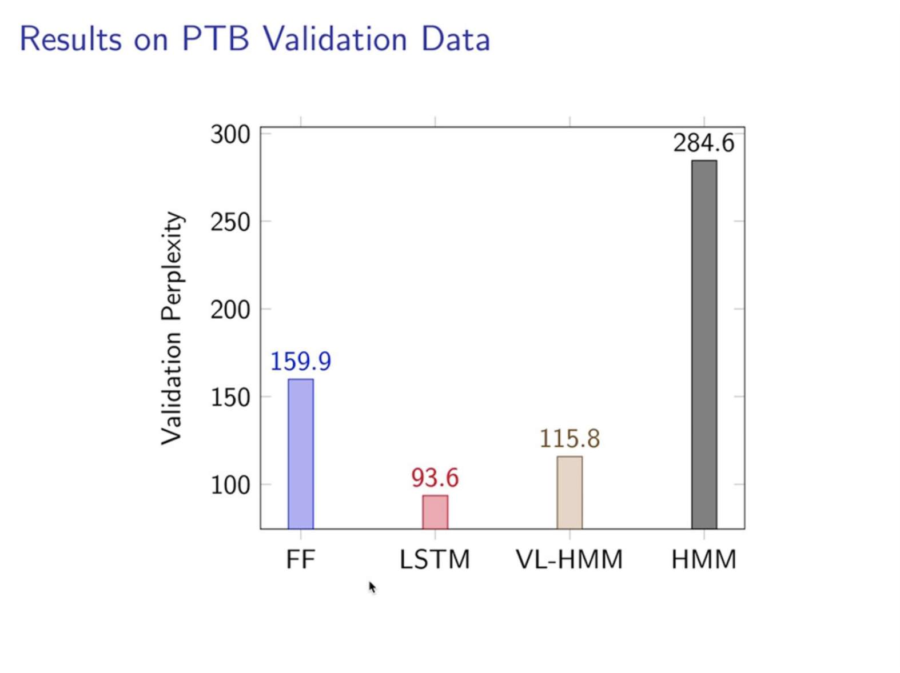

# EMNLP 2020 Notes

## First Virtual Conf:

- Virtual conference is fun, but need one or two days to get use to it.

- Since all talks are available as recored videos, spend more time to conference talks,
  and less time in communication

- Great thanks to the organizer, many tools make it very convenient:
  zoom, slack, slideslive, \*calendar, topic knowledge graph, are nicely integrated together

- gather.town is very interesting, and very useful

  
  [fig] Talk with one sponsor

  
  [fig] join poster session

- Polling shows many don't want to go back to the traditional conference, maybe more hybrid conference in the future

## Summaries:

- less fine tune BERT works:
  fine tuned BERT on one task and report on new dataset

- More Explainable NLP:
  - understanding the blackbox NLP models
  - mainly pre-trained contextualized embeddings

- BERTology
  - Different Variations of pre-trained models
  - compress BERT models into smaller, faster models
    - quantized model, not much, in this conference:
      - TernaryBert: Huawei
      - BiQGEMM: Samsung
    - distilling: most of the compression work is in this direction, current popular ones:

- Multilingual embeddings most about exploring, understanding and interpreting mBERT

- weakly-supervised and unsupervised models
  - many rely on the pre-trained contextualized embedding
  - other techs e.g. RL is also used, but same goal as using pre-trained embedding, to select better training data

- More work on Knowledge graph:
  - Entity Representations in LMs
  - NLP Models augmented with structured knowledge

*****
*****

## Keynote:

### Information Extraction Through the Years: How Did We Get Here?
Claire Cardie

- method, datasets, questions in the early stage of information extraction

- how the fields involved

### Friends Don’t Let Friends Deploy Black-Box Models: The Importance of Intelligibility in Machine Learning

Rich Caruana

- the most accurate models usually are not very intelligible, and the most intelligible models usually are less accurate

- Glass box ML:

  EBM: Explainable Boosting Machine

  https://github.com/interpretml/interpret

### Linguistic Behaviour and the Realistic Testing of NLP Systems.
Janet Pierrehumbert

- general characteristics of human linguistic behaviour, the extent to which they are, or are not addressed in current NLP methodology.

- Emperor Tower is the highest build in New York (was true in xxxx)

- kiwi is a bird (is true in New Zealand, but not in Australian)

- Context is always import, benchmarking dataset collected out of context is a problem.

*****
*****

## best paper

- demo paper:

  https://huggingface.co/transformers/

  Transformers: state-of-the-art Natural language processing

- best long paper: Digital voicing of silent speech

- honorable mentions:
  - If beam search is the answer, what was the question?

  - Glucose: Generalized and COntextualized story explanations

  - Spot The Bot: A Robust and Efficient Framework for the evaluation of Conversational Dialogue Systems

  - Visually Grounded compound CFPG

- best short paper: not found

*****
*****

## Transformers and attention:

### Which \*BERT? A Survey Organizing Contextualized Encoders
Patrick Xia, Shijie Wu, Benjamin Van Durme

https://virtual.2020.emnlp.org/paper_main.2579.html

https://www.aclweb.org/anthology/2020.emnlp-main.608

A survey or a lesson when looking at various pretrained contextualized embeddings.

- leaderboards without real leader
- overfitting on our understanding, most trained on EN wiki+bookcorpus
- Expensive evaluation

### ETC: Encoding Long and Structured Inputs in Transformers

https://virtual.2020.emnlp.org/paper_main.1618.html

https://slideslive.com/38938951

- can we directly encode much larger context (e.g. 10x)
- can we encode their nesting/hierarchy or graph relationship?

method:
- Global-Local attention: Global attends to all tokens, local attends to nearby tokens (similar to Longformer)

- relative position representation (Shaw et al. 2019)
- constrative predictive coding: pre-training objective to help model to use global summary tokens

training tech:
- using BERT|RoBERTa to boost the training

*****
*****

## Information Extraction and Text Mining

### *Named Entity Recognition Only from Word Embeddings*
Ying Luo, Hai Zhao, Junlang Zhan

https://virtual.2020.emnlp.org/paper_main.989.html

https://www.aclweb.org/anthology/2020.emnlp-main.723

- NER without supervised data
- course-fine steps approach:
  coarse parser and followed by a fine grain model with reinforcement learning
- Model:
  - first apply k-mean cluster on the word embeddings of the whole vocabulary word into 1 and 0,
    assumption: NEs are more similar in position in the corpus and syntactically and semantically related

  - repeated train Gaussian Hidden Markov model, create non-entity and entity phrases on fine-tuned embeddings
    i.e. (1, 0) => (B, I, O), x -> z and fine tune x

  

  - then feed the entity into Deep Autoencoding Gaussian Mixture Model (DAGMM) to identify the entity types

  - During the training phase, the estimation network estimates the parameters of GMM and evaluates the likelihood for the instances. Given the low-dimensional representation t and the number of entity types K as the number of mixture components, MLP maps the representation to the K-dimension space.

  

  - The final output is the result of K (the number of entity types) classification.

  - NER tagger, trained using the noisy labelled instance from above process

  - reinforcement learning to select the samples: https://www.aclweb.org/anthology/C18-1183.pdf
    reward: conditional probability from NER tagger, for every sentence in one batch, agent get reward after one batch

    

    

- Question: how well the model generalized to other problems?

Our model are mainly based on the assumption that similar NEs are more likely to be neighbors, since such NEs are more similar in position in the corpus and syntactically and semantically related, common NEs like PER/LOC/ORG satisfy this assumption, thus it works. For other schemas, if their NEs also satisfy this assumption, I think it should work. But we did not perform experiments on such dataset.

*****

### *Text Classification Using Label Names Only: A Language Model Self-Training Approach*
https://www.aclweb.org/anthology/2020.emnlp-main.724.pdf
- input: label name, pre-trained embeddings, unlabeled data
- first step, associates semantically related words with the label names
  method: top 50 from BERT generated when Masked labeled word + stop word cleaning + multiple label cleaning

  

- second step: finds category-indicative words and trains the model to predict their implied categories
  method: mask the semantically related words, and use BERT to generate top 50 candidate, if e.g. 20 overlap
  with category words, mark as positive sample. Train the first classifier with category-indicative word masked.

  

- third step: generalizes the model via self-training, iteratively use the model’s current prediction P to
  compute a target distribution Q which guides the model for refinement
  method: find more labeled data with KL divergence loss, apply model and
  - hard-lable: set all samples with confidence > xx to 1, worse reslt
  - soft-lable: softmax the lable, then normalize it to 0~1, better result

  

*****
*****

## workshop Deep Learning Inside Out (DeeLIO):

The First Workshop on Knowledge Extraction and Integration for Deep Learning Architectures

### You can lead a horse to water...: Representing vs. Using Features in Neural NLP
Ellie Pavlick
https://slideslive.com/38940165

understand what DLM modle has learned:
- probing: what type of features representation encoded
  for a trained representation, freeze the embedding, add a specific task, does model learn to perform using the embedding information, for a range of tasks:

  

- Challenging tasks: do model perform as they are using this features
  See some problems:
  - NLI: overlap token sentences are more predicted as True
  - Co-ref: difficult for all models
  - QA: easy to adversarial attack

- are feature lost during fine-tuning, not really
  - catastrophical forget:
  no obvious drop in probing accuracy after fine-tuning

  - maybe there is not just enough signal in training:
    - model seems better when increase the training data for overlap tokens problems
    - blame on training data does not explain everything since different features behave differently given the same training data

- not because feature is there or not there, but how the feature is used

  - feature is also differ in how hard they can be extracted from representation
    MDL: minimum description length (2020 Voita and Titov)

  - hypothesis: A fine tuned model's use of a feature ("target feature") is a function of the difficulty of extracting the feature (relative to the spurious features) and training evidence against the competing spurious features

- experimental design

  - first simple toy model: has 1, has repeated, double repeated in beginning ..

  - add spurious features, e.g. always add "very often" to positive, select longer sentence for negative ..

  - check the amount of data needed to obtain certain performance versus MDL

  ## Interpretability and Analysis of Models for NLP

  ### Information-Theoretic Probing with Minimum Description Length
  Elena Voita, Ivan Titov
  https://virtual.2020.emnlp.org/paper_main.947.html

  - how to understand if a model captures a linguistic property?
    probe the relation between the representation and labels:
    - probing, use accuracy as measure
    - but it also has problem, result may change with hyperparameters and randomseeds

  - solution
    - need to measure the regularity of the data

  

    - Minimum Description Length of labels knowing representations

  

*****
*****

## *Machine Translation and Multilinguality*

### On Negative Interference in Multilingual Models: Findings and A Meta-Learning Treatment

Zirui Wang, Zachary C. Lipton, Yulia Tsvetkov

https://virtual.2020.emnlp.org/paper_main.1445.html

https://www.aclweb.org/anthology/2020.emnlp-main.359

- Modern multilingual models are trained on concatenated text from multiple languages in hopes of conferring benefits to each (positive transfer), with the most pronounced benefits accruing to low-resource languages.

- problem: Negative interference: degrade performance on high-resource languages

- findings:
  - negative interference also impacts low-resource languages
  - language-specific parameters do exist in multilingual models and they are potential cause of negative interference

- solution:
  a meta-learning algorithm that obtains better cross-lingual transferability and alleviates negative interference, by adding language-specific layers as meta-parameters and training them in a manner that explicitly improves shared layers' generalization on all languages

*****

### From Zero to Hero: On the Limitations of Zero-Shot Language Transfer with Multilingual Transformers
by Anne Lauscher, Vinit Ravishankar, Ivan Vulić, Goran Glavaš

https://virtual.2020.emnlp.org/paper_main.2500.html

https://www.aclweb.org/anthology/2020.emnlp-main.363

- Massively multilingual transformers (MMTs) pretrained via language modeling (e.g., mBERT, XLM-R) have become a default paradigm for zero-shot language transfer in NLP, offering unmatched transfer performance.

- SOTA paradigm for cross-lingual transfer:

  Multilingual pretrain -> Massively multilingual transfer ->
  Fine-tune on target task (English) -> Predict on target language

- this work:

  analyze the limitations of downstream language transfer with MMTs, showing that, much like cross-lingual word embeddings, they are substantially less effective in resource-lean scenarios and for distant languages

  - quality on different tasks and target language with different level of available resources

  - what is the role of language dissimilarity

*****

### A Simple Approach to Learning Unsupervised Multilingual Embeddings
Pratik Jawanpuria, Mayank Meghwanshi, Bamdev Mishra

https://virtual.2020.emnlp.org/paper_main.410.html

https://www.aclweb.org/anthology/2020.emnlp-main.240

- two stage method:
  - first using the existing Unsupervised bilingual alignment method form N-1 language pairs
  - then learn multilingual word embedding using GeoMM (a Manifold Based
Alignment (MBA) algorithm, this become possible due to recent development in manifold stochastic optimization methods)

*****
*****

## ML in NLP

### Calibration of Pre-trained Transformers
Shrey Desai, Greg Durrett

https://virtual.2020.emnlp.org/paper_main.2615.html

https://www.aclweb.org/anthology/2020.emnlp-main.21.pdf

- interesting line of work, if the model is difficult to interprete, can we trust the model on the confidence scores they produced.

- what is model calibration:
A model is calibrated if the confidence estimates of its predictions are aligned with empirical likelihoods. For example, if we take 100 samples where a model’s prediction receives posterior probability
0.7, the model should get 70 of the samples correct.

- in domain and out-of domain calibration

Indomain calibration of BERT and RoBERTa

out-of-domain calibration seems also not bad

*****

### Ensemble Distillation for Structured Prediction: Calibrated, Accurate, Fast—Choose Three
Steven Reich, David Mueller, Nicholas Andrews
https://virtual.2020.emnlp.org/paper_main.2834.html

- ensembling seems better in not only accuracy, but also better calibration model, but more costly

- distilling the ensembling model into a single model, to have not only a smaller model, but also keep the better calibration

- distill_loss(y, p, q) = L(y, q) + D(p, q)
  y: label, p: ensembling model, q: student model

*****

### BERT-of-Theseus: Compressing BERT by Progressive Module Replacing
Canwen Xu, Wangchunshu Zhou, Tao Ge, Furu Wei, Ming Zhou

https://virtual.2020.emnlp.org/paper_main.1574.html

https://www.aclweb.org/anthology/2020.emnlp-main.633

- loss function for distilling is difficult, and training is very sensitive to the hyper-parameters in the loss function

- directly using the same loss, but replace part of layers with smaller model

*****

### Scaling Hidden Markov Language Models
Justin Chiu, Alexander Rush

https://virtual.2020.emnlp.org/paper_main.2632.html

- RNNs do not decouple the latent dynamics from the observed. This often leads to improved accuracy, but precludes posterior inference which is useful for interpretability
- HMM is O(T|Z^2) algorithem, Z is the number of the hidden states. When Z is large, e.g., doc generator, HMM is not a option

Method: scaling HMM
- Blocked Emissions

- Neural Parameterization:
A neural parameterization allows us to share parameters between words and states to capture common structure.
- Dropout as State Reduction:
to encourage full use of the large state space, we introduce dropout that prevents the model from favoring specific states. We propose a form of HMM state dropout that removes states from use entirely at each batch, which also has the added benefit of speeding up inference.

*****
*****

## NLP Applications

### To Schedule or not to Schedule: Extracting Task Specific Temporal Entities and Associated Negation Constraints

Barun Patra, Chala Fufa, Pamela Bhattacharya, Charles Lee

https://virtual.2020.emnlp.org/paper_main.3573.html

https://www.aclweb.org/anthology/2020.emnlp-main.678

- Application: looking for positive/negative time confirmation in email, and book the meeting if calendar free

- date-time entity extraction from text, and find date-time entities present in the text are pertinent to solving the task.

*****
*****

## Interpretability and Analysis of Models for NLP

### With Little Power Comes Great Responsibility
- define the power for the evaluation on the improvement from the model
- Test set should be large enough to have reasonable power to detect modest improvement

- data set: smaller, less Power
- data set: higher inner difference between annotators, stronger power

- Question from Mark Johnson: similar to the work from the past where people look at the statistical significance, and another direction is generalization level of the improvement, model improve on one field, do we also see them also on another field.

- how this related to cross validaion: future work

*****
*****

## workshop BlackboxNLP 2020: Analyzing and interpreting neural networks for NLP

### When BERT Plays the Lottery, All Tickets are Winning!
Anna Rogers
https://slideslive.com/38939762/when-bert-plays-the-lottery-all-tickets-are-winning

- Recent papers on understanding BERT:
  - linguistic knowledge can be extracted from pre-trained BERT weights
    Hewitt and Manning 2019, Liu et al 2019
  - linguistic of self attention
  - information difference in different layers
  - not stable across fine-tuning inits
  - BEAT is heavily over-parameterized

- Lottery ticket hypothesis:
  Dense, random initialized, feed-forward network contains subnetworks that when
  when training in isolation, reach comparable accuracy to original network

- Question:
  - Does LTH holds for pre-trained BERT?
  - does subnetworks stable with random seeds
  - do pruned subnetworks help to explain why BERT works?

- methods:
  1. unstructured magnitude prunning:
     iteratively remove 10% of the least magnitude weights, eval, repeat if > 90% full model performance

  2. structured prunning:
     estimate the sensitivity of the header and layers

- conclusion:
  sub-network could reach almost the full models
  any sub-network you take, it will not be horrible
  even bad/random sub-network reach similar afer retrain

*****
*****

## others

### Advances in Sequence Knowledge Distillation
 Alexander Rush, Yoon Kim, Demi Guo, Sam Shleifer, Victor Sanh

https://slideslive.com/38940102

 - train small student to match larger teacher

 - sequence knowledge distillation

 - multi class classification: MLE  L = KL(P_T|P_S)
   P_S: probabilities from student classifier
   P_T: probabilities from teach classifier

 - sequence:
   - turn sequence to a series of classification problem: but not always working
   - since the the temporal property
